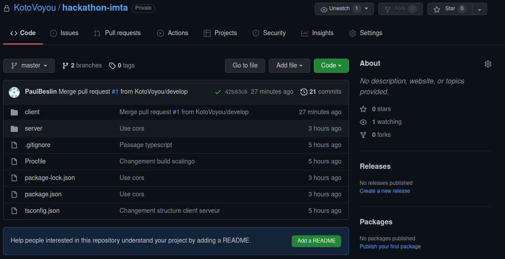
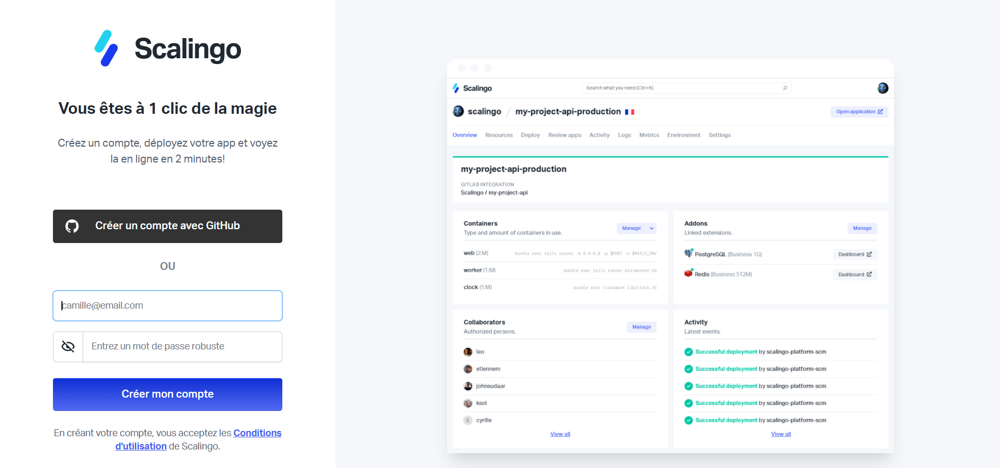
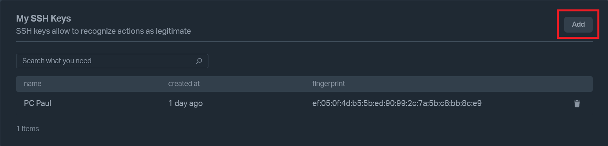
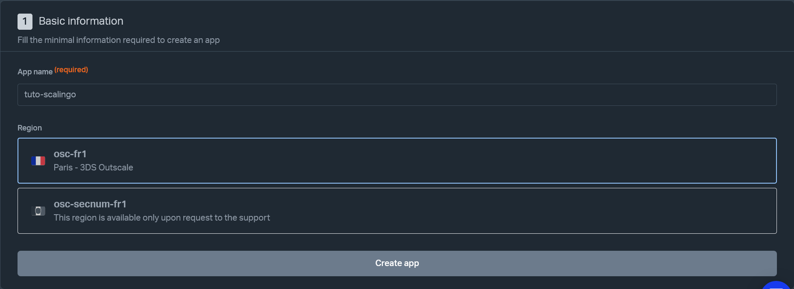
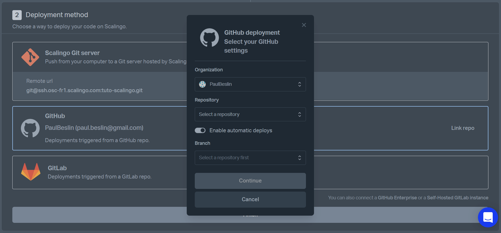
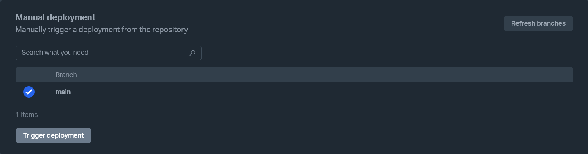
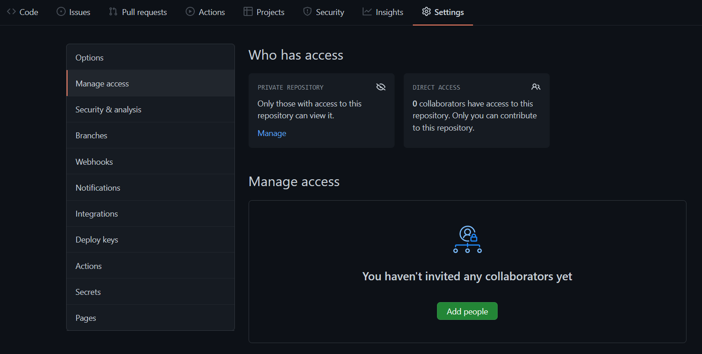
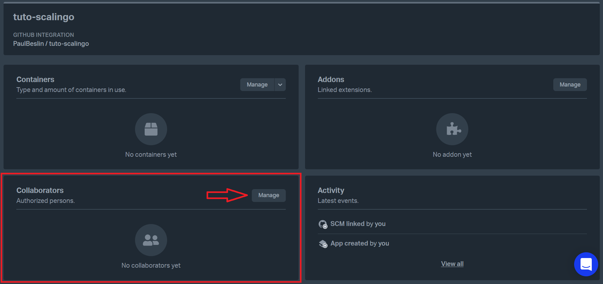

# Guide d'installation

## Github

Tout le code est hébergé sous Github dans un repo privé. Un dossier client pour le client et un dossier server pour l’API.

Commencer par cloner le repo [https://github.com/KotoVoyou/hackathon-imta/](https://github.com/KotoVoyou/hackathon-imta/)

## Développement local

Le client est écrit en react et l’API grâce au framework express en typescript donc Node.js est nécessaire pour le fonctionnement du projet. Les versions utilisées sont 14.18.2 pour node et 6.14.15 pour npm.

Installation des dépendances: `npm install`  
Lancement du projet: `npm run start`  
Build du projet: `npm run build`

La commande `npx create-react-app mon-app` permet de créer un projet React fonctionnel, dans le dossier mon-app.  
Pour lancer uniquement le client react utiliser `npm run start` depuis le dossier client

## Déploiement sur scalingo

### Créatrion d'un compte

Il est conseillé de créer son compte Scalingo à partir d’un compte Github, puisque celui-ci sera nécessaire pour la suite.
https://auth.scalingo.com/users/sign_up

### Créer une clé SSH

si ce n’est pas déjà fait. Elle servira à autoriser la connexion entre votre ordinateur et Scalingo, lorsque des commandes Git seront nécessaires.

-   Sur Linux et MacOS : il suffit d’exécuter la commande `ssh-keygen`.
-   Sur Windows : il faut au préalable installer git-bash ou un logiciel équivalent. La manipulation complète est disponible ici : https://doc.scalingo.com/platform/getting-started/setup-ssh-windows

### Enregistrer la clé SSH

[Enregistrer](https://dashboard.scalingo.com/account/keys) la clé SSH dans le compte Scalingo. La clé est une chaîne de caractères présente dans le fichier id_rsa.pub, qui commence par ssh-rsa et se termine par le nom de l’ordinateur.

### Créer une application

Créer une application Scalingo. Il faut renseigner : le nom de l’application (qui sera apparent dans l’URL d’accès à l’application), le dépôt Github à lier (celui créé à l’étape précédente) et son propriétaire (il est nécessaire de lier son compte Github à cette étape si cela n’a pas été fait), ainsi que la branche qui sera liée.
Cette étape permettra de déployer via Scalingo le code présent sur le dépôt sélectionné.

Si le déploiement automatique est activé, tout commit sur la branche choisie entraînera un redéploiement de l’application mise à jour par Scalingo. Les autres branches du dépôt seront ignorées.

### Activer le déploiement automatique

Si le déploiement automatique n’a pas été activé à l’étape précédente, il faut se rendre dans l’onglet “Deploy” et choisir la branche à déployer.

### Ajouter des collaborateurs

Pour travailler en collaboration avec d’autres développeurs, il faut leur autoriser l’accès à la fois sur le dépôt Github et sur l’application Scalingo.

-   Sur Github : Onglet “Settings” > “Manage access” > “Add people”.
-   Sur Scalingo : Onglet “Overview” > “Manage” > “Add”

